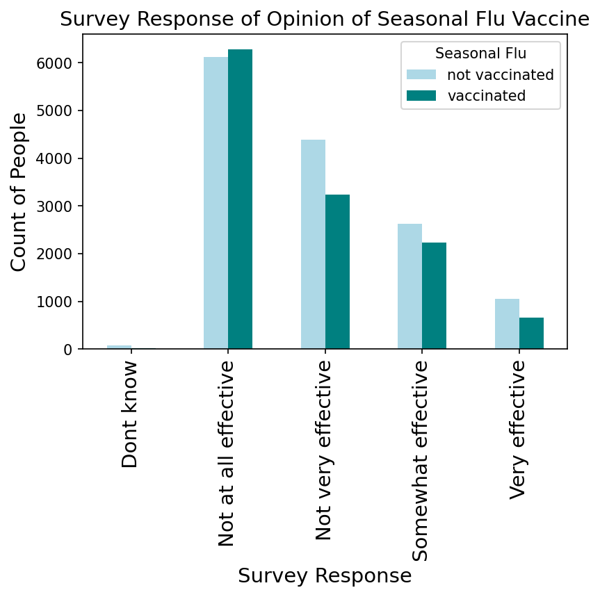
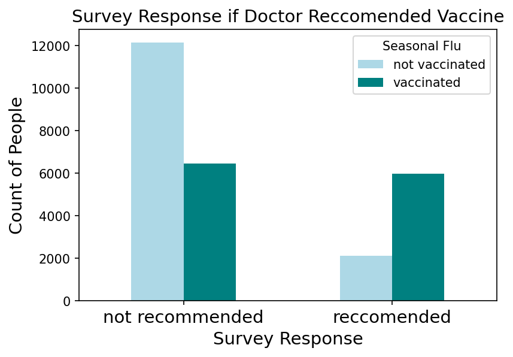

# Seasonal Flu Vaccine Analysis


## Business Problem

Raising the number of people choosing to get the seasonal flu vaccine can save lives. As part of the public outreach team for the CDC raising awareness of the flu is a constant goal. In 2009 the team created and administered the National Seasonal Flu Survey in hopes to better understand who is & who isn't getting the vaccine. The goal of this analysis was to do that, find the most important features of those who choose to get vaccinated. Finding what those people have in common will be able to give the team a direction in future marketing efforts.

## The Data

The data used for this project was from the 2009 National Flu Survey, a survey administered to the American public containing 30 questions, referred to as the columns in this analysis, which were relevant to the seasonal flu. All responses with data pertaining to the seasonal flu were used, totaling 26,707 surveys.

## Methods

A binary classification model was used in this analysis. Each question of the survey is a feature, some features have more of a significance on predicting an outcome than others. A base model was continually improved upon in hopes of correctly identifying the top influential features. To be properly modeled the data was cleaned and the model was tuned using multiple techniques to raise the accuracy and precision of the model.

To answer the business question, a high precision is important. This is because we want to focus on people who are correctly identified as vaccinated or not, and understand their survey responses. We want to make sure the model is analyzing relevant data. Surveys that are grouped incorrectly, those responses will be associated with the wrong group and disrupt the quality of the model’s results.
 

## Results

The goal of this analysis is to find the most influential features of those who choose to get vaccinated.

The model found the survey responses that were most influential in predicting a vaccinated person:
 - What is your opinion of the seasonal flu vaccine effectiveness? Response: Very Effective
 - Were you recommended to get the seasonal flu vaccine by a doctor? Response: Yes.  
 
The visualization shows there is a possible impact of whether a doctor recommends the seasonal flu vaccine to an individual. The amount of people who chose not to get vaccinated but were recommended to get the vaccine was dramatically lower than those who were not recommended. Looking at the percentages of people recommended to get the vaccine vs. those who were not shows: only 35% of people got vaccinated who were not recommended to, whereas 75% of people were vaccinated who were recommended to do so. 





## Conclusion

- I recommend the client consider ways they can gear their marketing efforts towards doctors recommending the vaccine, as that is the clearest connection the model found.
- At this stage in the investigation I do not advise the client to look for guidance in the survey responses for opinion on the seasonal flu vaccine.
- The final model had a precision of 0.78. In response, this model should only be used as a starting point in brainstorming what areas to further research when considering a marketing strategy. 

 

## Next Steps

- Consider analyzing more data specific to doctors recommending the seasonal flu vaccine.
- Further tune the model using more modeling methods to raise the accuracy and precision.


## For More Information

See the full analysis here: [Jupyter Notebook](./Vaccine_Analysis.ipynb) or review the presentation: [presentation](./Vaccine_Presentation.pdf).

## Repository Structure

```
├── data
├── images
├── Vaccine_Analysis.ipynb
├── Vaccine_Presentation.pdf
└── README.md
```

